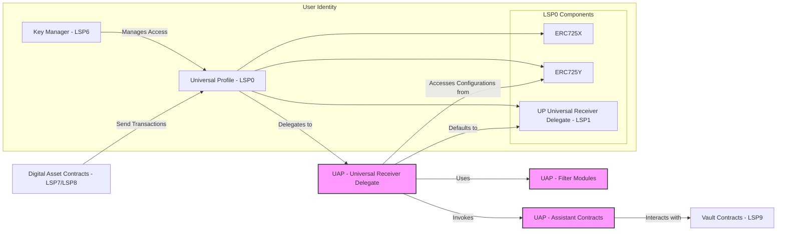

## Universal Assistant Protocol - Architecture Diagram

## Detailed Component Descriptions and Interactions

### 1. Universal Profile (UP) - LSP0

**Components:**

- **ERC725X**: Allows for executing generic function calls.
- **ERC725Y**: Provides a key-value data store for arbitrary data.
- - **Universal Receiver Delegate (LSP1)**: Handles incoming transactions and messages.

**Role:**

- Acts as the user's on-chain identity.
- Stores configurations and preferences via the ERC725Y key-value store.
- Delegates transaction handling to the Universal Receiver Delegate.

**Interactions:**

- **Receives transactions** from Digital Asset Contracts (LSP7/LSP8).
- **Delegates incoming transactions** to the URDuap.
- **Access controlled** by the Key Manager (KM).

### 2. Key Manager (KM) - LSP6

**Role:**

- Manages permissions and access control for the UP.

**Responsibilities:**

- Controls who can modify the UP's data and configurations.
- Ensures only authorized entities can interact with sensitive functions.

**Interactions:**

- Manages access to the UP.
- Enforces permission checks for actions on ERC725X and ERC725Y.

### 3. Digital Asset Contracts - LSP7/LSP8

**Role:**

- Represent fungible (LSP7) and non-fungible (LSP8) tokens within the LUKSO ecosystem.

**Interactions:**

- Send transactions to the UP.
- Trigger the Universal Receiver Delegate upon asset transfer or interaction.

### 4. Universal Receiver Delegate for UAP (URDuap)

**Role:**

- The UAP's implementation of the Universal Receiver Delegate.
- Replaces or extends the default LSP1 delegate in the UP.

**Responsibilities:**

- Handles incoming transactions based on `typeId`.
- Accesses user configurations from ERC725Y.
- Utilizes Filter Modules to evaluate transactions.
- Invokes Assistant Contracts to execute user-defined actions.
- Defaults to standard LSP1 behavior if no specific actions are defined.

**Interactions:**

- **Delegated to by UP**: UP delegates transaction handling to URDuap.
- **Accesses configurations from ERC725Y**: Reads user-defined actions and filters.
- **Uses Filter Modules (FM)**: Evaluates filters to decide on action execution.
- **Invokes Assistant Contracts (AC)**: Executes specific actions when filters pass.
- **Defaults to LSP1**: Falls back to default behavior if no actions match.

### 5. ERC725Y Data Store

**Role:**

- Provides a key-value storage mechanism for the UP.

**Responsibilities:**

- Stores configurations, user-defined actions, and filters.
- Accessible by URDuap to retrieve necessary data.

**Interactions:**

- Accessed by URDuap for configurations.
- Managed through ERC725Y interface with access control via KM.

### 6. Filter Modules (FM)

**Role:**

- Define criteria to evaluate incoming transactions.

**Responsibilities:**

- Evaluate transaction data based on user-defined conditions.
- Return boolean results indicating whether to proceed with an action.

**Interactions:**

- Used by URDuap to process filters before invoking actions.

### 7. Assistant Contracts (AC)

**Role:**

- Modular contracts performing specific actions upon invocation.

**Responsibilities:**

- Implement predefined interfaces for compatibility.
- Execute user-defined actions (e.g., redirecting assets, notifications).

**Interactions:**

- Invoked by URDuap after filters pass.
- Interact with Vault Contracts for asset management.

### 8. Vault Contracts - LSP9

**Role:**

- Secure storage for assets managed by Assistant Contracts.

**Responsibilities:**

- Hold assets redirected by assistants (e.g., unwanted tokens).
- Provide interfaces for users to access or manage stored assets.

**Interactions:**

- Assistant Contracts interact with Vaults to store assets.
- Ensure secure separation from the main UP.

### 9. Default Universal Receiver Delegate (LSP1)

**Role:**

- The standard Universal Receiver Delegate implementation.

**Responsibilities:**

- Handles incoming transactions in the default manner.
- Provides basic processing when no user-defined actions apply.

**Interactions:**

- URDuap defaults to this behavior if no applicable filters/actions are found.

## **Workflow Description**

### **Scenario: Handling Incoming LSP7/LSP8 Asset Transfer**

1. **Transaction Initiation:**

   - An LSP7 or LSP8 asset is transferred to the UP.
   - The transfer triggers the `universalReceiver` function with the corresponding `typeId`.

2. **Delegation to `URDuap`:**

   - The UP delegates the handling of the transaction to `URDuap`.

3. **Action Lookup:**

   - `URDuap` retrieves the list of action identifiers associated with the `typeId` from `ERC725Y`.
   - In this case, it finds `spamBoxActionId`.

4. **Retrieve Action Details:**

   - `URDuap` fetches the action details for `spamBoxActionId`:
     - Assistant Contract: Spam Manager
     - Filter IDs: `notInCuratedListFilterId`
     - Logic: "NOT IN"

5. **Filter Evaluation:**

   - **Filter Retrieval:**
     - `URDuap` retrieves the filter definition for `notInCuratedListFilterId`.
     - The filter references the curated list at `0xCuratedListLSP8CollectionAddress`.

   - **Check Curated List:**
     - The Filter Module checks if the asset address (sender of the transfer) exists as a token ID in the LSP8 Collection (curated list).
     - **If the asset address is NOT in the curated list:**
       - The filter evaluates to `true` (since logic is "NOT IN").
     - **If the asset address IS in the curated list:**
       - The filter evaluates to `false`.

6. **Action Execution:**

   - **If Filter Evaluates to True:**
     - `URDuap` invokes the Spam Manager Assistant Contract.
     - The Spam Manager redirects the asset to the Vault (spam box) using `LSP9`.
   - **If Filter Evaluates to False:**
     - No action is taken, and `URDuap` defaults to standard UP URD behavior.

7. **Default Handling:**

   - If no actions are executed, `URDuap` delegates to the default `LSP1` implementation.

