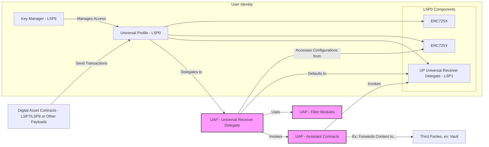
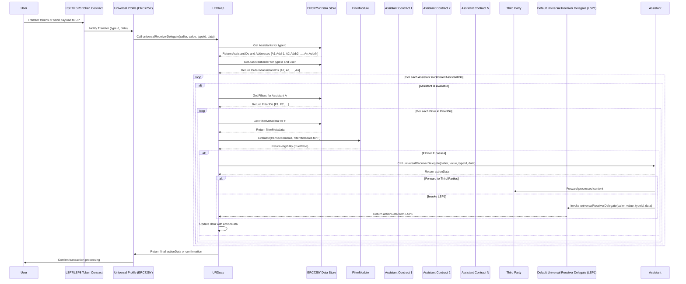

## Universal Assistant Protocol - Architecture Diagram

## Detailed Component Descriptions and Interactions

### 1. Universal Profile (UP) - LSP0

**Components:**

- **ERC725X**: Allows for executing generic function calls.
- **ERC725Y**: Provides a key-value data store for arbitrary data.
- - **Universal Receiver Delegate (LSP1)**: Handles incoming transactions and messages.

**Role:**

- Acts as the user's on-chain identity.
- Stores configurations and preferences via the ERC725Y key-value store.
- Delegates transaction handling to the Universal Receiver Delegate.

**Interactions:**

- **Receives transactions** from Digital Asset Contracts (LSP7/LSP8).
- **Delegates incoming transactions** to the URDuap.
- **Access controlled** by the Key Manager (KM).

### 2. Key Manager (KM) - LSP6

**Role:**

- Manages permissions and access control for the UP.

**Responsibilities:**

- Controls who can modify the UP's data and configurations.
- Ensures only authorized entities can interact with sensitive functions.

**Interactions:**

- Manages access to the UP.
- Enforces permission checks for actions on ERC725X and ERC725Y.

### 3. Digital Asset Contracts - LSP7/LSP8

**Role:**

- Represent fungible (LSP7) and non-fungible (LSP8) tokens within the LUKSO ecosystem.

**Interactions:**

- Send transactions to the UP.
- Trigger the Universal Receiver Delegate upon asset transfer or interaction.

### 4. Universal Receiver Delegate for UAP (URDuap)

**Role:**

- The UAP's implementation of the Universal Receiver Delegate.
- Replaces or extends the default `LSP1` delegate in the `UP`.

**Responsibilities:**

- Handles incoming transactions based on `typeId`.
- Accesses user configurations from `ERC725Y`.
- Utilizes Filter Modules to evaluate transactions.
- Invokes Assistant Contracts to execute user-defined actions.
- Defaults to standard `LSP1` behavior if no specific actions are defined.

**Interactions:**

- **Delegated to by UP:** `UP` delegates transaction handling to `URDuap`.
- **Accesses configurations from ERC725Y:** Reads user-defined actions and filters.
- **Uses Filter Modules (`FM`):** Evaluates filters to decide on action execution.
- **Invokes Assistant Contracts (`AC`):** Executes specific actions when filters pass.
- **Defaults to `LSP1`:** Falls back to default behavior if no actions match.

### 5. ERC725Y Data Store

**Role:**

- Provides a key-value storage mechanism for the UP.

**Responsibilities:**

- Stores configurations, user-defined actions, and filters.
- Accessible by URDuap to retrieve necessary data.

**Interactions:**

- Accessed by URDuap for configurations.
- Managed through ERC725Y interface with access control via KM.

### 6. Filter Modules (FM)

**Role:**

- Define criteria to evaluate incoming transactions.

**Responsibilities:**

- Evaluate transaction data based on user-defined conditions.
- Return boolean results indicating whether to proceed with an action.

**Interactions:**

- Used by URDuap to process filters before invoking actions.

### 7. Assistant Contracts (AC)

**Role:**

- Modular contracts performing specific transformations to tx contents upon invocation.
- Assistants can forward processed content to external entities (`Third Parties`, e.g., Vaults)

**Responsibilities:**

- Implement predefined interfaces for compatibility.
- Execute user-defined actions (e.g., redirecting assets, notifications).

**Interactions:**

- Invoked by URDuap after filters pass.
- Can forward modified transaction content to 3rd parties and/or default UP Universal Receiver Delegate

### 8. Vault Contracts - LSP9

**Role:**

- Secure storage for assets managed by Assistant Contracts.

**Responsibilities:**

- Hold assets redirected by assistants (e.g., unwanted tokens).
- Provide interfaces for users to access or manage stored assets.

**Interactions:**

- Assistant Contracts interact with Vaults to store assets.
- Ensure secure separation from the main UP.

### 9. Default Universal Receiver Delegate (LSP1)

**Role:**

- The standard Universal Receiver Delegate implementation.

**Responsibilities:**

- Handles incoming transactions in the default manner.
- Provides basic processing when no user-defined actions apply.
- **Supports invocation by Assistants:** Allows Assistants to delegate further processing by invoking `LSP1`.

**Interactions:**

- **`URDuap` Defaults to This Behavior:** If no applicable filters/actions are found.
- **Assistants Invoke `LSP1`:** When additional processing is required beyond the scope of Assistants.

## Detailed Universal Assistant Protocol Transaction Flow

---

### **Flow Explanation**

1. **User Initiates Transaction:**
   - The **User** interacts with the **LSP7 Token Contract** to transfer tokens to their **Universal Profile (UP)**.
   - The **LSP7 Token Contract** notifies the **Universal Profile** of the transfer, including relevant details such as `typeId` and additional `data`.

2. **Delegation to `URDuap`:**
   - The **Universal Profile** delegates the handling of the incoming transaction to the **Universal Receiver Delegate (`URDuap`)** by calling the `universalReceiverDelegate` function with parameters: `caller`, `value`, `typeId`, and `data`.

3. **Retrieving Assistants Based on `typeId`:**
   - **URDuap** queries the **ERC725Y Data Store** to retrieve a list of **Assistant IDs** and their corresponding **Assistant Addresses** associated with the specific `typeId`.
   - The **ERC725Y Data Store** responds with a mapping of **Assistant IDs** to their **Addresses** (e.g., `[A1:Addr1, A2:Addr2, ..., An:AddrN]`).

4. **Retrieving User-Configured Assistant Execution Order:**
   - **URDuap** fetches the user-defined execution order of **Assistants** for the given `typeId` and **User** from the **ERC725Y Data Store**.
   - This order determines the sequence in which **Assistants** will be invoked (e.g., `[A2, A1, ..., An]`).

5. **Processing Each Assistant in Order:**
   - **URDuap** enters a loop to process each **Assistant** based on the user-configured order.
   
   - **For Each Assistant (e.g., A2, A1, ..., An):**
     - **Check Assistant Availability:**
       - **URDuap** verifies if the **Assistant** is available and enabled. If not, it skips to the next **Assistant**.
   
     - **Retrieving Filters Associated with the Assistant:**
       - **URDuap** retrieves the list of **Filter IDs** associated with the **Assistant** from the **ERC725Y Data Store**.
       - The **ERC725Y Data Store** responds with an array of **Filter IDs** (e.g., `[F1, F2, ...]`).

6. **Evaluating Each Filter via the Filter Module:**
   - **For Each Filter (e.g., F1, F2, ...):**
     - **Retrieve Filter Metadata:**
       - **URDuap** fetches the detailed `filterMetadata` for the **Filter** from the **ERC725Y Data Store**.
       - The **ERC725Y Data Store** responds with the `filterMetadata`.
     
     - **Filter Evaluation:**
       - **URDuap** sends the `transactionData` and `filterMetadata` to the **Filter Module** by invoking the `evaluate` function.
       - The **Filter Module** processes the criteria defined in the **Filter** and returns a boolean indicating eligibility (`true` if the transaction meets the criteria, `false` otherwise).
     
     - **Conditional Assistant Invocation:**
       - **If the Filter Passes (`true`):**
         - **URDuap** invokes the **Assistant's** `universalReceiverDelegate` function, passing along the transaction details (`caller`, `value`, `typeId`, `data`).
         - The **Assistant** processes the transaction and returns `actionData`.
         - **URDuap** updates the `data` with the returned `actionData`, preparing it for potential subsequent **Assistants** in the sequence.
       
       - **If the Filter Does Not Pass (`false`):**
         - **URDuap** skips the invocation of the corresponding **Assistant** and proceeds to the next **Filter** or **Assistant** in the sequence.

7. **Finalizing Transaction Handling:**
   - After processing all **Assistants**, **URDuap** sends the final `actionData` or a confirmation back to the **Universal Profile**.
   - The **Universal Profile** then confirms the successful processing of the transaction to the **User**.

---

### **Detailed Component Roles**

1. **Universal Receiver Delegate (`URDuap`):**
   - Acts as the central orchestrator for handling incoming transactions.
   - Fetches **Assistants** based on `typeId` and **User**.
   - Retrieves and evaluates **Filters** via the **Filter Module**.
   - Invokes eligible **Assistants** in the user-defined order, passing along transaction data and handling the chaining of results.

2. **ERC725Y Data Store (LSP2):**
   - Serves as the storage layer for all user-specific configurations, including **Assistants**, **Filters**, and their associations.
   - Maintains mappings between `typeId`, **User**, **Assistant IDs**, and **Filter IDs**.
   - Ensures efficient retrieval of configuration data for **URDuap**.

3. **Assistants:**
   - Modular contracts that perform specific actions upon invocation.
   - Implement the `universalReceiverDelegate` function to handle transaction data.
   - Designed to be reusable across multiple users and transaction types.

4. **Filters:**
   - Configurable metadata defining the criteria under which an **Assistant** should be invoked.
   - Linked to specific **Assistants** and are evaluated per transaction via the **Filter Module**.
   - Enable users to customize transaction handling based on their unique requirements.

5. **Filter Module:**
   - Evaluates transaction data against **Filter** criteria to determine eligibility.
   - Implements the logic for various `FilterCriteria` and `LogicalOperators`.
   - Decouples the evaluation logic from **Assistants**, promoting modularity and maintainability.

6. **LSP7 Token Contract:**
   - Facilitates the transfer of tokens to the **Universal Profile**.
   - Triggers the `universalReceiverDelegate` function upon token transfers, initiating the processing workflow.
  

