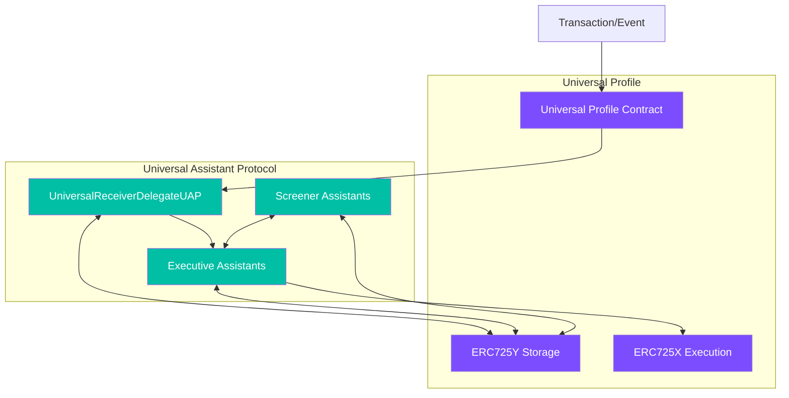

# Universal Assistant Protocol (UAP)

The Universal Assistant Protocol (UAP) extends LUKSO's blockchain ecosystem by providing programmable automation for Universal Profiles. UAP enables profiles to respond intelligently and autonomously to incoming and outgoing transactions through a configurable system of "Executive Assistants".

## Overview

UAP is built on top of LUKSO's Universal Receiver pattern (LSP1) and provides an extensible framework where users can configure their Universal Profile to handle various types of blockchain interactions automatically based on customizable rules and conditions.

## Architecture



## Core Components

### 1. UniversalReceiverDelegateUAP

This is the central contract of the UAP system. It extends LUKSO's `LSP1UniversalReceiverDelegateUP` and serves as the main entry point for handling incoming transactions and events in a Universal Profile.

Main responsibilities:
- Receives notifications through the `universalReceiverDelegate` function when transactions are sent to or from a Universal Profile
- Looks up the appropriate configuration for the transaction type
- Executes the chain of Executive Assistants after running them through configured Screeners
- Manages the execution flow between multiple Assistants

### 2. Executive Assistants

Executive Assistants perform actions on behalf of the Universal Profile. They implement the `IExecutiveAssistant` interface and are responsible for executing specific tasks in response to transactions.

Examples included:
- **ForwarderAssistant**: Automatically forwards received tokens (LSP7/LSP8) to another address
- **TipAssistant**: Sends a percentage of received native tokens (LYX) to a specified address
- **BurntPixRefinerAssistant**: Specialized assistant for interacting with the BurntPix system

Each Executive Assistant:
- Is associated with a specific transaction type
- Can be configured with custom parameters
- Can execute arbitrary transactions through the Universal Profile

### 3. Screener Assistants

Screener Assistants implement filtering logic to determine whether an Executive Assistant should execute. They implement the `IScreenerAssistant` interface and return boolean values.

Examples included:
- **NotifierListScreener**: Determines whether to execute based on if a notifier address is on a predefined list
- **NotifierCurationScreener**: Uses a LSP8 token-based curation system to determine allowed notifiers

Screeners can be chained together with AND/OR logic to create complex conditions.

## Data Structure

The UAP uses ERC725Y key-value storage for configuration with a well-defined schema:

- **UAPTypeConfig**: Maps transaction typeIds to a list of Executive Assistants
- **UAPExecutiveConfig**: Stores configuration parameters for each Executive Assistant
- **UAPExecutiveScreeners**: Defines Screener Assistants for each Executive Assistant
- **UAPExecutiveScreenersANDLogic**: Defines logical operator (AND/OR) for chained Screeners
- **UAPAddressListName**: Stores named lists of addresses for use by various Assistants

For a detailed overview of the schema for storing configurations please refer to:
1. [UAP Schema](./schemas/UAP.json)
2. [UAP Schema Overview](./UAP-Schema-Breakdown.md)

## Transaction Flow

1. A transaction is sent to a Universal Profile (receiving tokens, native currency, etc.)
2. The Universal Profile's Universal Receiver forwards this to the Universal Receiver Delegate (UAP)
3. The URD checks if there's a configuration for the transaction's typeId
4. For each configured Executive Assistant:
   - All associated Screener Assistants are evaluated
   - If Screeners approve, the Executive Assistant executes its action
   - The Executive Assistant can modify transaction data or value for subsequent Assistants
5. The URD returns control to the Universal Profile

## Executive Assistant Examples

### ForwarderAssistant

Automatically forwards tokens received by a Universal Profile to another address.

- **Use case**: Setting up a forwarding address for all received tokens
- **Configuration**: Target address to receive the forwarded tokens
- **Supported Standards**: LSP7 (fungible tokens) and LSP8 (non-fungible tokens)

### TipAssistant

Sends a percentage of received native tokens (LYX) to a specified address.

- **Use case**: Automatically sharing a percentage of incoming funds
- **Configuration**: Recipient address and percentage to send

### BurntPixRefinerAssistant

Specialized assistant for interacting with the BurntPix system.

- **Use case**: Automating the refinement of BurntPix tokens
- **Configuration**: BurntPix collection address, token ID, and iteration count

## Screener Assistant Examples

### NotifierListScreener

Filters transactions based on a list of addresses stored in the Universal Profile.

- **Use case**: Allowing only specific addresses to trigger automation
- **Configuration**: List name and return value when in list

### NotifierCurationScreener

Uses LSP8 tokens for a more flexible and decentralized curation system.

- **Use case**: Token-gated automation based on ownership of specific NFTs
- **Configuration**: LSP8 contract address and return value configuration

## Integration with Universal Profiles

To use UAP with a Universal Profile:

1. Deploy the UniversalReceiverDelegateUAP contract
2. Set it as the Universal Receiver Delegate for your Universal Profile
3. Deploy the desired Executive and Screener Assistants
4. Configure your Universal Profile with the appropriate ERC725Y data

## Benefits

- **Automation**: Perform actions automatically when receiving assets
- **Customization**: Create tailored automation rules with screeners and assistants
- **Composability**: Mix and match different assistants for complex behaviors
- **Extensibility**: Easily create new assistants for specific use cases

## Security Considerations

- Executive Assistants can execute arbitrary transactions through the Universal Profile
- Carefully review all assistants before configuring them
- Use screeners to limit which transactions can trigger assistants
- Test configurations thoroughly before deploying to mainnet

## Development

To develop new Assistants:

1. For Executive Assistants, extend `ExecutiveAssistantBase` and implement the `execute` function
2. For Screener Assistants, extend `ScreenerAssistantBase` and implement the `evaluate` function

## Installing and Deployment

Ensure your .env file is configured.

Install & Run Tests:

```bash
npm install
npm run test
```

Deploy the UAP URD and multiple assistants at once:

```bash
npx hardhat deployContracts \
  --network luksoTestnet \
  --names "UniversalReceiverDelegateUAP,ForwarderAssistant" \
  --paths "contracts,contracts/executive-assistants"
```

## Verifications

Verify the UAP URD and multiple assistants post-deployment:

```bash
npx hardhat verifyContracts \
  --network luksoTestnet \
  --names "UniversalReceiverDelegateUAP,TipAssistant,BurntPixRefinerAssistant,ForwarderAssistant" \
  --addresses "0xcf44a050c9b1fc87141d77b646436443bdc05a2b,0xf24c39a4d55994e70059443622fc166f05b5ff14,0x34a8ad9cf56dece5790f64f790de137b517169c6,0x67cc9c63af02f743c413182379e0f41ed3807801" \
  --paths "contracts,contracts/executive-assistants,contracts/executive-assistants,contracts/executive-assistants"
```

## Project Status

This project is currently still in early beta/development. Use at your own risk.

## License

Licensed under Apache-2.0 and MIT licenses as specified in the individual contract files.