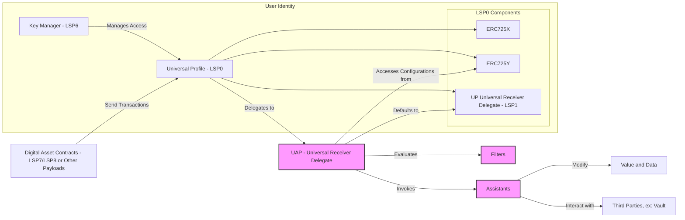
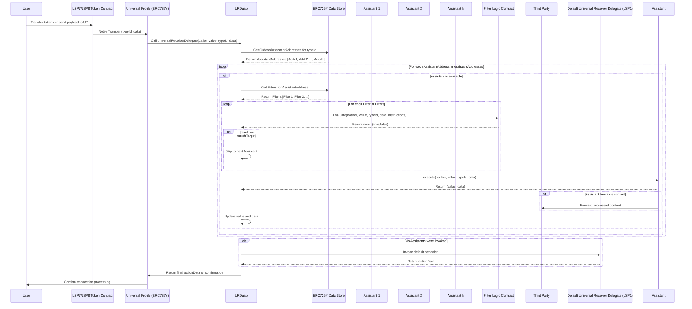

# Universal Assistant Protocol - Architecture Diagram



---

## Detailed Component Descriptions and Interactions

### 1. Universal Profile (UP) - LSP0

**Components:**

- **ERC725X**: Allows for executing generic function calls.
- **ERC725Y**: Provides a key-value data store for arbitrary data.
- **Universal Receiver Delegate (LSP1)**: Handles incoming transactions and messages.

**Role:**

- Acts as the user's on-chain identity.
- Stores configurations and preferences via the ERC725Y key-value store.
- Delegates transaction handling to the Universal Receiver Delegate.

**Interactions:**

- **Receives transactions** from Digital Asset Contracts (LSP7/LSP8).
- **Delegates incoming transactions** to the URDuap.
- **Access controlled** by the Key Manager (KM).

### 2. Key Manager (KM) - LSP6

**Role:**

- Manages permissions and access control for the UP.

**Responsibilities:**

- Controls who can modify the UP's data and configurations.
- Ensures only authorized entities can interact with sensitive functions.

**Interactions:**

- Manages access to the UP.
- Enforces permission checks for actions on ERC725X and ERC725Y.

### 3. Digital Asset Contracts - LSP7/LSP8

**Role:**

- Represent fungible (LSP7) and non-fungible (LSP8) tokens within the LUKSO ecosystem.

**Interactions:**

- Send transactions to the UP.
- Trigger the Universal Receiver Delegate upon asset transfer or interaction.

### 4. Universal Receiver Delegate for UAP (URDuap)

**Role:**

- The UAP's implementation of the Universal Receiver Delegate.
- Replaces or extends the default `LSP1` delegate in the `UP`.

**Responsibilities:**

- Handles incoming transactions based on `typeId`.
- Accesses user configurations from `ERC725Y`.
- Retrieves Assistants associated with the `typeId`.
- For each Assistant, retrieves Filters associated with it.
- Evaluates Filters to determine whether to invoke the Assistant.
- Invokes Assistants that pass the filter evaluation.
- Updates `value` and `data` based on Assistant's execution.
- Defaults to standard `LSP1` behavior if no configurations are found or no Assistants are invoked.

**Interactions:**

- **Delegated to by UP**: `UP` delegates transaction handling to `URDuap`.
- **Accesses configurations from ERC725Y**: Reads user-defined Assistants and Filters.
- **Evaluates Filters**: Determines eligibility of Assistants.
- **Invokes Assistants**: Calls the `execute` function of eligible Assistants.
- **Updates Value and Data**: Modifies transaction data based on Assistants' output.
- **Defaults to `LSP1`**: Falls back to default behavior if no actions match.

### 5. ERC725Y Data Store

**Role:**

- Provides a key-value storage mechanism for the UP.

**Responsibilities:**

- Stores configurations, including mappings from `typeId` to Assistants.
- Stores Filters associated with each Assistant.
- Accessible by URDuap to retrieve necessary data.

**Interactions:**

- Accessed by URDuap for configurations.
- Manages mappings such as:
  - `UAPTypeConfig:<typeId>` → `AssistantAddresses[]`
  - `UAPAssistantFilters:<assistantAddress>` → `FilterData[]`
- Managed through ERC725Y interface with access control via KM.

### 6. Filters

**Role:**

- Define criteria to evaluate whether an Assistant should be invoked.

**Responsibilities:**

- Each Filter is associated with an Assistant.
- Contains:
  - `filterLogicAddress`: Address of the contract that performs the evaluation logic.
  - `matchTarget`: Expected boolean result to decide Assistant invocation.
  - `instructions`: Additional data required for evaluation.
- Evaluated per Assistant to determine eligibility.

**Interactions:**

- Evaluated by URDuap for each Assistant.
- URDuap calls `evaluate` function on the `filterLogicAddress` with transaction data and `instructions`.
- The result is compared with `matchTarget` to decide on Assistant invocation.

### 7. Assistants

**Role:**

- Modular contracts performing specific actions upon invocation.

**Responsibilities:**

- Implement an `execute` function to process transaction data.
- Can modify `value` and `data` for subsequent processing.
- May forward content to external entities (e.g., Vaults).
- Return updated `value` and `data` to URDuap.

**Interactions:**

- Invoked by URDuap after filters pass.
- Receive current `value` and `data` from URDuap.
- Return updated `value` and `data`.
- May interact with Third Parties.

### 8. Vault Contracts - LSP9

**Role:**

- Secure storage for assets managed by Assistants.

**Responsibilities:**

- Hold assets redirected by Assistants (e.g., unwanted tokens).
- Provide interfaces for users to access or manage stored assets.

**Interactions:**

- Assistants interact with Vaults to store assets.
- Ensure secure separation from the main UP.

### 9. Default Universal Receiver Delegate (LSP1)

**Role:**

- The standard Universal Receiver Delegate implementation.

**Responsibilities:**

- Handles incoming transactions in the default manner.
- Provides basic processing when no user-defined actions apply.

**Interactions:**

- **`URDuap` Defaults to This Behavior**: If no applicable Assistants are found.
- **Assistants May Not Invoke `LSP1` Directly**: Assistants handle specific actions independently.

---

## Detailed Universal Assistant Protocol Transaction Flow



---

### **Flow Explanation**

1. **User Initiates Transaction:**
   - The **User** interacts with the **LSP7 Token Contract** to transfer tokens to their **Universal Profile (UP)**.
   - The **LSP7 Token Contract** notifies the **UP** of the transfer, including `typeId` and `data`.

2. **Delegation to `URDuap`:**
   - The **UP** delegates the handling to the **URDuap** by calling `universalReceiverDelegate(caller, value, typeId, data)`.

3. **Retrieving Assistants Based on `typeId`:**
   - **URDuap** queries the **ERC725Y Data Store** for an ordered list of **Assistant Addresses** associated with `typeId`.

4. **Processing Each Assistant in Order:**
   - **URDuap** loops through each **Assistant** in the retrieved order.
   - **Checks Assistant Availability**: Skips if the Assistant is unavailable or disabled.

5. **Evaluating Filters:**
   - For each **Assistant**, **URDuap** retrieves associated **Filters** from **ERC725Y**.
   - **URDuap** evaluates each **Filter** using the **Filter Logic Contract**.
   - Compares the result with `matchTarget` to decide if the Assistant should be invoked.
   - If any filter fails to match, **URDuap** skips to the next **Assistant**.

6. **Invoking Assistant's `execute` Function:**
   - If all filters pass, **URDuap** invokes the **Assistant's** `execute` function.
   - **Assistant** processes the transaction, potentially modifying `value` and `data`.
   - **Assistant** may interact with **Third Parties**.
   - **URDuap** updates `value` and `data` based on the Assistant's output.

7. **Finalizing Transaction Handling:**
   - After all Assistants are processed, **URDuap** may invoke **LSP1** if no Assistants were invoked.
   - **URDuap** returns the final action data to the **UP**.
   - The **UP** confirms the transaction processing to the **User**.

---

### **Detailed Component Roles**

1. **Universal Receiver Delegate (`URDuap`):**
   - Orchestrates transaction handling.
   - Retrieves and evaluates Assistants and their Filters.
   - Invokes eligible Assistants via `execute` function.
   - Updates transaction data based on Assistants' output.
   - Defaults to standard behavior if necessary.

2. **ERC725Y Data Store:**
   - Stores configurations for Assistants and Filters.
   - Provides data retrieval for URDuap.

3. **Assistants:**
   - Modular contracts performing specific actions.
   - Implement `execute` function to process data.
   - May modify `value` and `data`.
   - Can interact with Third Parties.

4. **Filters:**
   - Define criteria for Assistant invocation.
   - Contain evaluation logic via `filterLogicAddress`.
   - Use `matchTarget` to determine eligibility.

5. **Filter Logic Contract:**
   - Evaluates Filters based on provided instructions.
   - Returns boolean results for comparison.

6. **LSP7 Token Contract:**
   - Initiates transactions to the UP.
   - Triggers the URDuap upon token transfers.


# Deployments
Deploy UAP URD and multiple assistants at once:
```npx hardhat deployContracts --network luksoTestnet --names "UniversalReceiverDelegateUAP,ForwarderAssistant" --paths "contracts,contracts/executive-assistants"```

# Verifications
Verify UAP URD and multiple assistants at once post deployment:
```npx hardhat verifyContracts --network luksoTestnet --names "UniversalReceiverDelegateUAP,TipAssistant,BurntPixRefinerAssistant,ForwarderAssistant" --addresses "0xcf44a050c9b1fc87141d77b646436443bdc05a2b,0xf24c39a4d55994e70059443622fc166f05b5ff14,0x34a8ad9cf56dece5790f64f790de137b517169c6,0x67cc9c63af02f743c413182379e0f41ed3807801" --paths "contracts,contracts/executive-assistants,contracts/executive-assistants,contracts/executive-assistants"```