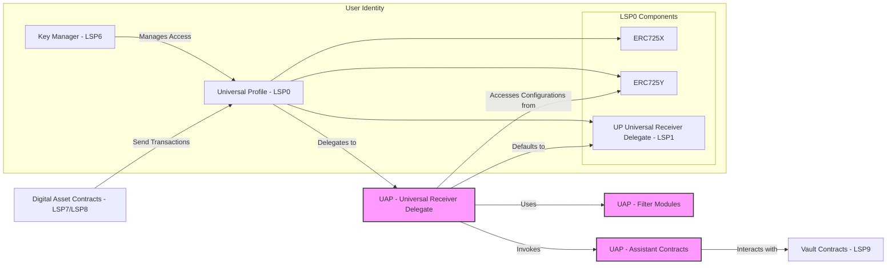

## Universal Assistant Protocol - Architecture Diagram


## Detailed Component Descriptions and Interactions

### 1. Universal Profile (UP) - LSP0

**Components:**

- **ERC725X**: Allows for executing generic function calls.
- **ERC725Y**: Provides a key-value data store for arbitrary data.
- - **Universal Receiver Delegate (LSP1)**: Handles incoming transactions and messages.

**Role:**

- Acts as the user's on-chain identity.
- Stores configurations and preferences via the ERC725Y key-value store.
- Delegates transaction handling to the Universal Receiver Delegate.

**Interactions:**

- **Receives transactions** from Digital Asset Contracts (LSP7/LSP8).
- **Delegates incoming transactions** to the URDuap.
- **Access controlled** by the Key Manager (KM).

### 2. Key Manager (KM) - LSP6

**Role:**

- Manages permissions and access control for the UP.

**Responsibilities:**

- Controls who can modify the UP's data and configurations.
- Ensures only authorized entities can interact with sensitive functions.

**Interactions:**

- Manages access to the UP.
- Enforces permission checks for actions on ERC725X and ERC725Y.

### 3. Digital Asset Contracts - LSP7/LSP8

**Role:**

- Represent fungible (LSP7) and non-fungible (LSP8) tokens within the LUKSO ecosystem.

**Interactions:**

- Send transactions to the UP.
- Trigger the Universal Receiver Delegate upon asset transfer or interaction.

### 4. Universal Receiver Delegate for UAP (URDuap)

**Role:**

- The UAP's implementation of the Universal Receiver Delegate.
- Replaces or extends the default LSP1 delegate in the UP.

**Responsibilities:**

- Handles incoming transactions based on `typeId`.
- Accesses user configurations from ERC725Y.
- Utilizes Filter Modules to evaluate transactions.
- Invokes Assistant Contracts to execute user-defined actions.
- Defaults to standard LSP1 behavior if no specific actions are defined.

**Interactions:**

- **Delegated to by UP**: UP delegates transaction handling to URDuap.
- **Accesses configurations from ERC725Y**: Reads user-defined actions and filters.
- **Uses Filter Modules (FM)**: Evaluates filters to decide on action execution.
- **Invokes Assistant Contracts (AC)**: Executes specific actions when filters pass.
- **Defaults to LSP1**: Falls back to default behavior if no actions match.

### 5. ERC725Y Data Store

**Role:**

- Provides a key-value storage mechanism for the UP.

**Responsibilities:**

- Stores configurations, user-defined actions, and filters.
- Accessible by URDuap to retrieve necessary data.

**Interactions:**

- Accessed by URDuap for configurations.
- Managed through ERC725Y interface with access control via KM.

### 6. Filter Modules (FM)

**Role:**

- Define criteria to evaluate incoming transactions.

**Responsibilities:**

- Evaluate transaction data based on user-defined conditions.
- Return boolean results indicating whether to proceed with an action.

**Interactions:**

- Used by URDuap to process filters before invoking actions.

### 7. Assistant Contracts (AC)

**Role:**

- Modular contracts performing specific actions upon invocation.

**Responsibilities:**

- Implement predefined interfaces for compatibility.
- Execute user-defined actions (e.g., redirecting assets, notifications).

**Interactions:**

- Invoked by URDuap after filters pass.
- Interact with Vault Contracts for asset management.

### 8. Vault Contracts - LSP9

**Role:**

- Secure storage for assets managed by Assistant Contracts.

**Responsibilities:**

- Hold assets redirected by assistants (e.g., unwanted tokens).
- Provide interfaces for users to access or manage stored assets.

**Interactions:**

- Assistant Contracts interact with Vaults to store assets.
- Ensure secure separation from the main UP.

### 9. Default Universal Receiver Delegate (LSP1)

**Role:**

- The standard Universal Receiver Delegate implementation.

**Responsibilities:**

- Handles incoming transactions in the default manner.
- Provides basic processing when no user-defined actions apply.

**Interactions:**

- URDuap defaults to this behavior if no applicable filters/actions are found.

## **Workflow Description**

### **Scenario: Handling Incoming LSP7/LSP8 Asset Transfer**

1. **Transaction Initiation:**

   - An LSP7 or LSP8 asset is transferred to the UP.
   - The transfer triggers the `universalReceiver` function with the corresponding `typeId`.

2. **Delegation to `URDuap`:**

   - The UP delegates the handling of the transaction to `URDuap`.

3. **Action Lookup:**

   - `URDuap` retrieves the list of action identifiers associated with the `typeId` from `ERC725Y`.
   - In this case, it finds `spamBoxActionId`.

4. **Retrieve Action Details:**

   - `URDuap` fetches the action details for `spamBoxActionId`:
     - Assistant Contract: Spam Manager
     - Filter IDs: `notInCuratedListFilterId`
     - Logic: "NOT IN"

5. **Filter Evaluation:**

   - **Filter Retrieval:**
     - `URDuap` retrieves the filter definition for `notInCuratedListFilterId`.
     - The filter references the curated list at `0xCuratedListLSP8CollectionAddress`.

   - **Check Curated List:**
     - The Filter Module checks if the asset address (sender of the transfer) exists as a token ID in the LSP8 Collection (curated list).
     - **If the asset address is NOT in the curated list:**
       - The filter evaluates to `true` (since logic is "NOT IN").
     - **If the asset address IS in the curated list:**
       - The filter evaluates to `false`.

6. **Action Execution:**

   - **If Filter Evaluates to True:**
     - `URDuap` invokes the Spam Manager Assistant Contract.
     - The Spam Manager redirects the asset to the Vault (spam box) using `LSP9`.
   - **If Filter Evaluates to False:**
     - No action is taken, and `URDuap` defaults to standard UP URD behavior.

7. **Default Handling:**

   - If no actions are executed, `URDuap` delegates to the default `LSP1` implementation.
  
## Storing UAP Configurations given Universal Profiles LSP2 specifications
### 1. JSON Schemas

Below are the JSON schema definitions for each required data key. Dynamic parts like `<actionId>`, `<filterId>`, and `<typeId>` are represented using placeholders.

### 1.1. Actions Array

Stores the list of `actionIds` defined by the user.

```json
{
  "name": "UAPConfig:Actions[]",
  "key": "0x<keccak256('UAPConfig:Actions[]')>",
  "keyType": "Array",
  "valueType": "bytes32",
  "valueContent": "Keccak256"
}
```

### 1.2. Action Details

Stores details for each action.

```json
{
  "name": "UAPAction:<actionId>",
  "key": "0x<bytes10(keccak256('UAPAction'))><bytes2('00')><bytes20(<actionId>)>",
  "keyType": "Mapping",
  "valueType": "(address, bytes, bytes)",
  "valueContent": "(Address, String, Bytes)"
}
```

### 1.3. Filters Array for Actions

Stores the list of `filterIds` associated with a specific action.

```json
{
  "name": "UAPAction:<actionId>:Filters[]",
  "key": "0x<keccak256('UAPAction:<actionId>:Filters[]')>",
  "keyType": "Array",
  "valueType": "bytes32",
  "valueContent": "Keccak256"
}
```

### 1.4. Filter Details

Stores details for each filter.

```json
{
  "name": "UAPFilter:<filterId>",
  "key": "0x<bytes10(keccak256('UAPFilter'))><bytes2('00')><bytes20(<filterId>)>",
  "keyType": "Mapping",
  "valueType": "(address, bytes)",
  "valueContent": "(Address, Bytes)"
}
```

### 1.5. TypeId to Action Mapping

Maps incoming transaction `TypeId`s to corresponding `actionIds`.

```json
{
  "name": "UAPTypeIdMapping:<typeId>",
  "key": "0x<bytes10(keccak256('UAPTypeIdMapping'))><bytes2('00')><bytes20(<typeId>)>",
  "keyType": "Mapping",
  "valueType": "bytes32",
  "valueContent": "Keccak256"
}
```

### 2. Mapping TypeIds to Actions

To handle incoming transactions, the UAP needs to map each transaction's `TypeId` to a corresponding action defined by the user. This mapping allows the UAP to determine which action to execute based on the transaction's `TypeId`.

### 2.1. Data Key Definition

- **Name**: `UAPTypeIdMapping:<typeId>`
- **Key Type**: `Mapping`
- **Value Type**: `bytes32` (actionId)
- **Value Content**: `Keccak256`

### 2.2. Key Derivation

```plaintext
key = bytes10(keccak256('UAPTypeIdMapping')) + bytes2(0) + bytes20(<typeId>)
```

**Example**:

For `typeId` = `0x01`, the key would be:

```plaintext
key = bytes10(keccak256('UAPTypeIdMapping')) + '0000' + '0000000000000000000000000000000000000001'
```

---

### 3. Understanding the Role of Stored Values

### 3.1. Actions

**Structure**:

- **assistantContract**: `address` – The contract to be invoked.
- **logic**: `string` – Defines the logic or condition (e.g., `"onReceive"`).
- **parameters**: `bytes` – Additional parameters for the action.

**Role in UAP**:

When a transaction with a specific `TypeId` is received, the UAP:

1. **Retrieves the corresponding `actionId`** from `UAPTypeIdMapping:<typeId>`.
2. **Fetches the Action Details** from `UAPAction:<actionId>`.
3. **Executes the `assistantContract`** with the specified `logic` and `parameters`.

### 3.2. Filters

**Structure**:

- **filterModuleAddress**: `address` – The module responsible for evaluating the filter.
- **parameters**: `bytes` – Parameters defining the filter criteria.

**Role in UAP**:

Filters determine whether an action should be executed based on transaction data. Before executing an action:

1. **UAP fetches all `filterIds`** associated with the `actionId` from `UAPAction:<actionId>:Filters[]`.
2. **Retrieves Filter Details** from `UAPFilter:<filterId>`.
3. **Evaluates each filter** using the `filterModuleAddress` and `parameters`.
4. **Executes the action only if all filters pass**.

---

### 4. Encoding and Decoding Data with ERC725.js and Ethers.js v6

We'll utilize **ERC725.js** for interacting with the ERC725Y data store and **ethers.js v6** for encoding and decoding data.

### 4.1. Installation

```bash
npm install @erc725/erc725.js ethers
```

### 4.2. Importing Libraries

```javascript
import { ERC725 } from '@erc725/erc725.js';
import { ethers } from 'ethers';
```

### 4.3. Encoding Data

#### 4.3.1. Encoding Action Details

**Function:**

```javascript
function encodeActionDetails(assistantContract, logic, parameters) {
  // Encode the assistantContract (20 bytes)
  const encodedAssistantContract = ethers.zeroPad(assistantContract, 20);

  // Encode the logic string with length prefix (2 bytes)
  const logicBytes = ethers.toUtf8Bytes(logic);
  const logicLength = ethers.zeroPad(ethers.toBeHex(logicBytes.length), 2); // 2 bytes
  const encodedLogic = ethers.concat([logicLength, logicBytes]);

  // Encode the parameters with length prefix (2 bytes)
  const parametersBytes = ethers.getBytes(parameters);
  const parametersLength = ethers.zeroPad(ethers.toBeHex(parametersBytes.length), 2); // 2 bytes
  const encodedParameters = ethers.concat([parametersLength, parametersBytes]);

  // Concatenate all parts
  const encodedValue = ethers.concat([encodedAssistantContract, encodedLogic, encodedParameters]);

  return ethers.hexlify(encodedValue);
}
```

**Usage Example:**

```javascript
const assistantContract = '0x1234567890abcdef1234567890abcdef12345678';
const logic = 'onReceive';
const parameters = '0xabcdef1234567890'; // Hex string or bytes array

const encodedAction = encodeActionDetails(assistantContract, logic, parameters);
```

#### 4.3.2. Encoding Filter Details

**Function:**

```javascript
function encodeFilterDetails(filterModuleAddress, parameters) {
  // Encode the filterModuleAddress (20 bytes)
  const encodedFilterModuleAddress = ethers.zeroPad(filterModuleAddress, 20);

  // Encode the parameters with length prefix (2 bytes)
  const parametersBytes = ethers.getBytes(parameters);
  const parametersLength = ethers.zeroPad(ethers.toBeHex(parametersBytes.length), 2); // 2 bytes
  const encodedParameters = ethers.concat([parametersLength, parametersBytes]);

  // Concatenate all parts
  const encodedValue = ethers.concat([encodedFilterModuleAddress, encodedParameters]);

  return ethers.hexlify(encodedValue);
}
```

**Usage Example:**

```javascript
const filterModuleAddress = '0x87654321fedcba0987654321fedcba0987654321';
const parameters = '0xcafebabedeadbeef'; // Hex string or bytes array

const encodedFilter = encodeFilterDetails(filterModuleAddress, parameters);
```

#### 4.3.3. Encoding TypeId to Action Mapping

**Function:**

```javascript
function encodeTypeIdMapping(typeId, actionId) {
  // Encode the typeId (assuming typeId is a uint16 represented as hex)
  const encodedTypeId = ethers.zeroPad(ethers.toBeHex(typeId), 2); // 2 bytes

  // Encode the actionId (32 bytes)
  const encodedActionId = ethers.zeroPad(actionId, 32);

  // Concatenate all parts
  const encodedValue = ethers.concat([encodedActionId]);

  return ethers.hexlify(encodedValue);
}
```

**Usage Example:**

```javascript
const typeId = 1; // Example TypeId
const actionId = ethers.keccak256(ethers.toUtf8Bytes('MyCustomAction'));

const encodedTypeIdMapping = encodeTypeIdMapping(typeId, actionId);
```

### 4.4. Decoding Data

#### 4.4.1. Decoding Action Details

**Function:**

```javascript
function decodeActionDetails(encodedValue) {
  const data = ethers.getBytes(encodedValue);
  let offset = 0;

  // Decode assistantContract (20 bytes)
  const assistantContractBytes = data.slice(offset, offset + 20);
  const assistantContract = ethers.getAddress(assistantContractBytes);
  offset += 20;

  // Decode logicLength (2 bytes)
  const logicLengthBytes = data.slice(offset, offset + 2);
  const logicLength = parseInt(ethers.toBeHex(logicLengthBytes), 16);
  offset += 2;

  // Decode logic
  const logicBytes = data.slice(offset, offset + logicLength);
  const logic = ethers.toUtf8String(logicBytes);
  offset += logicLength;

  // Decode parametersLength (2 bytes)
  const parametersLengthBytes = data.slice(offset, offset + 2);
  const parametersLength = parseInt(ethers.toBeHex(parametersLengthBytes), 16);
  offset += 2;

  // Decode parameters
  const parametersBytes = data.slice(offset, offset + parametersLength);
  const parameters = ethers.hexlify(parametersBytes);

  return {
    assistantContract,
    logic,
    parameters,
  };
}
```

**Usage Example:**

```javascript
const decodedAction = decodeActionDetails(encodedAction);
console.log(decodedAction);
/*
{
  assistantContract: '0x1234567890abcdef1234567890abcdef12345678',
  logic: 'onReceive',
  parameters: '0xabcdef1234567890'
}
*/
```

#### 4.4.2. Decoding Filter Details

**Function:**

```javascript
function decodeFilterDetails(encodedValue) {
  const data = ethers.getBytes(encodedValue);
  let offset = 0;

  // Decode filterModuleAddress (20 bytes)
  const filterModuleAddressBytes = data.slice(offset, offset + 20);
  const filterModuleAddress = ethers.getAddress(filterModuleAddressBytes);
  offset += 20;

  // Decode parametersLength (2 bytes)
  const parametersLengthBytes = data.slice(offset, offset + 2);
  const parametersLength = parseInt(ethers.toBeHex(parametersLengthBytes), 16);
  offset += 2;

  // Decode parameters
  const parametersBytes = data.slice(offset, offset + parametersLength);
  const parameters = ethers.hexlify(parametersBytes);

  return {
    filterModuleAddress,
    parameters,
  };
}
```

**Usage Example:**

```javascript
const decodedFilter = decodeFilterDetails(encodedFilter);
console.log(decodedFilter);
/*
{
  filterModuleAddress: '0x87654321fedcba0987654321fedcba0987654321',
  parameters: '0xcafebabedeadbeef'
}
*/
```

#### 4.4.3. Decoding TypeId to Action Mapping

**Function:**

```javascript
function decodeTypeIdMapping(encodedValue) {
  const data = ethers.getBytes(encodedValue);
  let offset = 0;

  // Decode actionId (32 bytes)
  const actionIdBytes = data.slice(offset, offset + 32);
  const actionId = ethers.keccak256(actionIdBytes);
  offset += 32;

  return {
    actionId,
  };
}
```

**Usage Example:**

```javascript
const decodedTypeIdMapping = decodeTypeIdMapping(encodedTypeIdMapping);
console.log(decodedTypeIdMapping);
/*
{
  actionId: '0xabcdef...123456'
}
*/
```

### 4.5. Interacting with ERC725.js

#### 4.5.1. Setting Data

**Function:**

```javascript
async function setData(key, encodedValue, signer) {
  // ERC725Y ABI fragment
  const erc725YAbi = [
    'function setData(bytes32[] keys, bytes[] values) external',
  ];

  // UP address
  const upAddress = '0xYourUPAddress';

  // Create contract instance
  const erc725YContract = new ethers.Contract(upAddress, erc725YAbi, signer);

  // Prepare data
  const keys = [key];
  const values = [encodedValue];

  // Send the transaction
  const tx = await erc725YContract.setData(keys, values);

  // Wait for transaction confirmation
  await tx.wait();

  console.log('Data set successfully:', tx.hash);
}
```

**Usage Example:**

```javascript
const { ethers } = require('ethers');
const provider = new ethers.JsonRpcProvider('https://your-node-url');
const signer = new ethers.Wallet('your-private-key', provider);

const actionKey = '0x...derivedKey...';
await setData(actionKey, encodedAction, signer);
```

#### 4.5.2. Getting Data

**Function:**

```javascript
async function getData(key, provider) {
  // ERC725Y ABI fragment
  const erc725YAbi = [
    'function getData(bytes32 key) view returns (bytes memory)',
  ];

  // UP address
  const upAddress = '0xYourUPAddress';

  // Create contract instance
  const erc725YContract = new ethers.Contract(upAddress, erc725YAbi, provider);

  // Fetch data
  const data = await erc725YContract.getData(key);

  return data;
}
```

**Usage Example:**

```javascript
const actionKey = '0x...derivedKey...';
const actionData = await getData(actionKey, provider);

const decodedAction = decodeActionDetails(actionData);
console.log(decodedAction);
```

---

### 5. Practical Example: Storing and Mapping TypeIds to Actions

### 5.1. Defining an Action

**Details**:

- **Action ID**: `0xabcdef...123456` (generated via `keccak256('MyCustomAction')`)
- **Assistant Contract**: `0x1234567890abcdef1234567890abcdef12345678`
- **Logic**: `"onReceive"`
- **Parameters**: `0xabcdef1234567890`

**Encoding Action Details**:

```javascript
const actionId = ethers.keccak256(ethers.toUtf8Bytes('MyCustomAction'));
const assistantContract = '0x1234567890abcdef1234567890abcdef12345678';
const logic = 'onReceive';
const parameters = '0xabcdef1234567890';

const encodedAction = encodeActionDetails(assistantContract, logic, parameters);
```

**Storing Action in ERC725Y**:

```javascript
const actionKey = ethers.keccak256(ethers.toUtf8Bytes(`UAPAction:${actionId}`));

await setData(actionKey, encodedAction, signer);
```

### 5.2. Defining a Filter for the Action

**Details**:

- **Filter ID**: `0xfeedface...deadbeef` (generated via `keccak256('FilterOne')`)
- **Filter Module Address**: `0x87654321fedcba0987654321fedcba0987654321`
- **Parameters**: `0xcafebabedeadbeef`

**Encoding Filter Details**:

```javascript
const filterId = ethers.keccak256(ethers.toUtf8Bytes('FilterOne'));
const filterModuleAddress = '0x87654321fedcba0987654321fedcba0987654321';
const filterParameters = '0xcafebabedeadbeef';

const encodedFilter = encodeFilterDetails(filterModuleAddress, filterParameters);
```

**Storing Filter in ERC725Y**:

```javascript
const filterKey = ethers.keccak256(ethers.toUtf8Bytes(`UAPFilter:${filterId}`));

await setData(filterKey, encodedFilter, signer);
```

### 5.3. Associating Filters with the Action

**Encoding Filter Association**:

```javascript
// Assuming we have one filter for simplicity
const filtersArrayKey = ethers.keccak256(ethers.toUtf8Bytes(`UAPAction:${actionId}:Filters[]`));

// Fetch current filters length
const currentFiltersData = await getData(filtersArrayKey, provider);
const currentFiltersLength = parseInt(ethers.toBeHex(currentFiltersData).slice(2), 16);

// New index
const newIndex = currentFiltersLength;

// Update filters length
const newFiltersLength = ethers.zeroPad(ethers.toBeHex(newIndex + 1), 2);
await setData(filtersArrayKey, ethers.hexlify(newFiltersLength), signer);

// Store the new filterId in the array
const filterElementKey = ethers.hexConcat([
  ethers.hexDataSlice(filtersArrayKey, 0, 16),
  ethers.zeroPad(ethers.toBeHex(newIndex), 16),
]);

await setData(filterElementKey, filterId, signer);
```

### 5.4. Mapping TypeId to Action

**Details**:

- **TypeId**: `0x01`
- **Action ID**: `0xabcdef...123456`

**Encoding TypeId Mapping**:

```javascript
const typeId = 1; // Example TypeId
const encodedTypeIdMapping = encodeTypeIdMapping(typeId, actionId);

// Derive the key
const typeIdHex = ethers.toBeHex(typeId); // e.g., '0x01'
const typeIdKey = ethers.keccak256(ethers.toUtf8Bytes(`UAPTypeIdMapping:${typeIdHex}`));

// Store the mapping
await setData(typeIdKey, encodedTypeIdMapping, signer);
```

